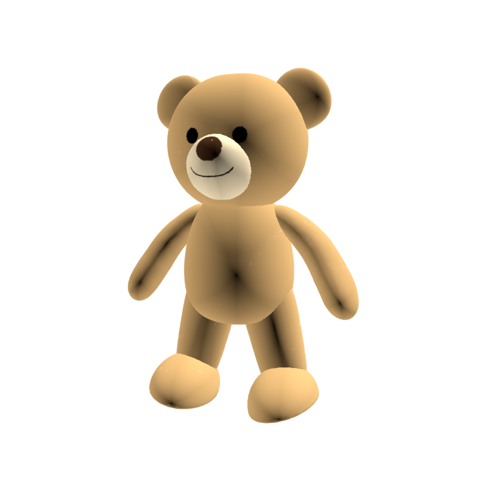
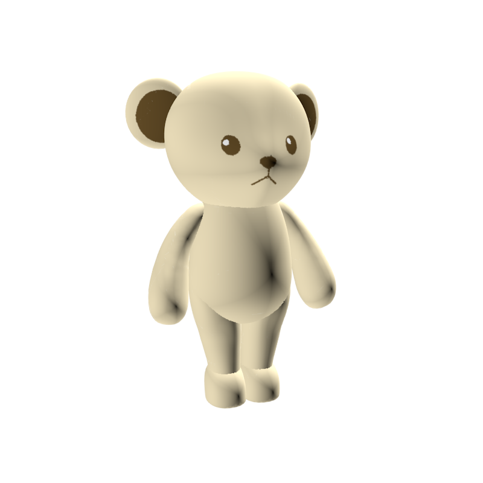
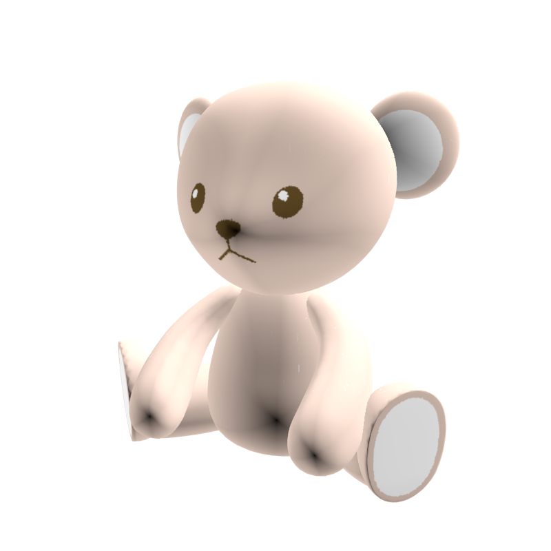
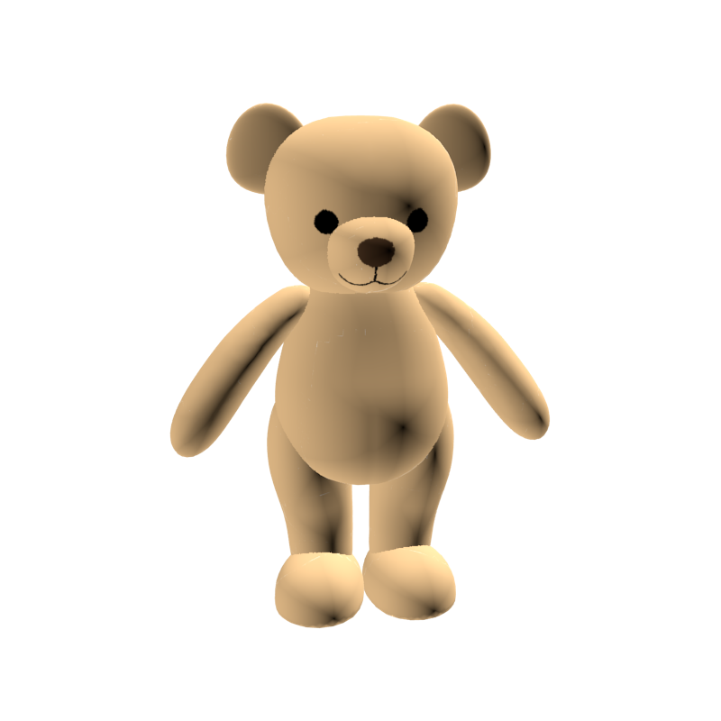

### Light Version implementation for NeRF & Fourier-Feature-Network (PyTorch)
1. Tested on customized blender data
2. Validate the Paper's effectiveness by comparing it with a Fully-Convolutioal-Network

### Fourier Feature Networks
1. scale = 10.0 achieves the best result
2. Fourier-Feature-Transform make features shift-invariant and tunable
3. run_mlp_batch.py mlp_batch.py
Train with multiple objects from same category, does not work, try to figure out a solution
#### Input to the mlp_batch

#### Output from mlp_batch

## References
https://github.com/yenchenlin/nerf-pytorch
https://people.eecs.berkeley.edu/~bmild/fourfeat/index.html